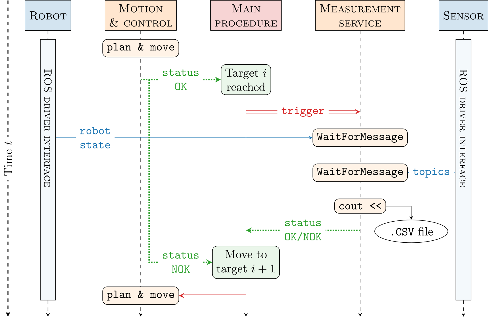

# robot_arm_tools

ROS package providing a simple interface to move a robot arm using the [Moveit](https://moveit.ai/) motion planning framework.

## Contents

- [robot\_arm\_tools](#robot_arm_tools)
  - [Intro](#intro)
  - [Feature overview](#feature-overview)
  - [Contents](#contents)
  - [Getting Started](#getting-started)
    - [Requirements](#requirements)
    - [Install](#install)
  - [Usage](#usage)
    - [Preliminary configurations](#preliminary-configurations)
    - [Adding a custom tool](#adding-a-custom-tool)
    - [Direct use](#direct-use)
    - [Library use](#library-use)
    - [Robotized measurements](#robotized-measurements)
    - [Advanced use](#advanced-use)
  - [Work in progress...](#work-in-progress)
  - [Testing](#testing)
  - [Contribute](#contribute)
  - [License](#license)

## Getting Started

### Requirements

* [ROS Noetic](http://wiki.ros.org/noetic/Installation/Ubuntu)

```bash
mkdir -p ~/catkin_ws/src && cd ~/catkin_ws/src
git clone https://gitlab.ensta.fr/pascal.2020/panda_draws_you
git clone https://github.com/TAMS-Group/bio_ik
cd ..
rosdep install --from-paths src --ignore-src -r -y
python3 pip install -r ~/catkin_ws/src/robot_arm_tools/requirements.txt #Additional python dependencies
```

### Build

```bash
cd ~/catkin_ws
catkin build
source devel/setup.bash
```

> A preliminary attention must be paid to the proper functioning of the robot ROS driver, which may involve the compilation of a PREEMPT_RT realtime Linux kernel. A tutorial can be found [here](PREEMPT_RT_TUTORIAL.md).

### Install via Docker

Thanks to Adrien Poiré, it is possible to directly use _robot\_arm\_tools_ with Docker ! See this [repository](https://gitlab.ensta.fr/poire/robot_arm_tools-docker) for more details.

## Usage

### Preliminary configurations

> Before use, a robot specific launch `launch/Setup_<robot_name>.launch` file must be created. A template can be found at [`launch/Setup_template.launch`](launch/Setup_template.launch), and must be filled according to the considered robot configuration.
>```robot_arm_tools``` supports all robots already supported by Moveit.

### Adding a custom tool 

It is possible to add a custom, unactuated tool on the robot flange, and to treat is as an integer part of the robot (_i.e._ motion planning, collisions, etc.). This is achieved thanks to a preload of the bare robot `/robot_description` and `/robot_description_semantic` ROS parameters, using the `--dump-params` option of `roslaunch`, which are then enriched with the tool parameters, stored in a dedicated `urdf.xacro` file, and fed to the actual `roslaunch` execution.

An automated procedure to define a new custom tool based on a STL file is provided by [`config/tools/NewTools.sh`](config/tools/NewTool.sh), and can be called as follows : 

```bash
./NewTool.sh <STL_file_path> <EE_X> <EE_Y> <EE_Z> <EE_RX> <EE_RY> <EE_RZ> <collisions_safety_distance> <tool_mass>
```

Where the `EE` labeled coordinates describe the tool end effector frame pose regarding to the robot flange frame. This procedure will create the `urdf.xacro` file needed for the runtime tool integration.

> For the script to be executed properly, the origin frame of the STL 3D model must match the desired tool end effector frame !

The created tool name will be set as the provided STL file basename, and the configuration files stored under the  `config/STL_file_basename` folder.

### Direct use

The package can directly be used to provide a functionnal setup of the considered robot by calling the corresponding setup launch file :

```bash
roslaunch robot_arm_tools Setup_<robot_name>.launch tool_name:=<tool_name> simulation:=<true/false> use_rviz_gui:=<true/false> gazebo:=<true/false> use_gazebo_gui:<true/false>
```

In this setting, four ROS actions are available to set pose or joints targets to the robot :
- [`/robot_pose_target_action`](action/PoseTarget.action) (pose target);
- [`/robot_joints_values_target_action`](action/JointsValuesTarget.action) (angular configuration target);
- [`/robot_pose_waypoints_action`](action/PoseWaypoints.action) (list of successive pose targets);
- [`/robot_joints_values_waypoints_action`](action/JointsValuesWaypoints.action) (list of successive angular configurations targets).

These actions may be launched by running the dedicated ROS node : 

```bash
rosrun robot_arm_tools robot_arm_tools_actions 
```

### Library use

Most of the package features are available when used as a library, as if offers a simplified interface with the Moveit API:
- [`Robot.h`](include/robot_arm_tools/Robot.h) Provides simple motion methods, such as `goToTarget(...)`, and several attributes describing the robot parameters and current state;
- [`RobotTrajectories.h`](include/robot_arm_tools/RobotTrajectories.h) Offers multiple trajectory generation routines, such as spherical trajectories, linear trajectories, etc.
- [`RobotVisualTools.h`](include/robot_arm_tools/RobotVisualTools.h) Allows the dynamic definition of collision objects within the robot workspace;
- [`RobotLowLevel.h`](include/robot_arm_tools/RobotLowLevel.h) Provides a plugin interface for robot low level startup, shutdown and recovery procedures. See [`URLowLevel.h`](include/robot_arm_tools/URLowLevel.h) and [`PandaLowLevel.h`](include/robot_arm_tools/PandaLowLevel.h) for examples;
- [`RobotLog.h`](include/robot_arm_tools/RobotLog.h) Provides logging features for multiple waypoints trajectories, and allows recovery in case of unexpected shutdown. 

Several exemples are given in the `_example_` labeled nodes.

This package also handles the modeling of _a priori_ known collisions objects stored in a YAML file. 

```bash
rosrun robot_arm_tools robot_arm_tools_environment_node _environmentFileName:=<collision_object_file>
```

Examples of collision objects files can be found at [`config/environments`](config/environments/).

> Eventhough the Franka Emika Panda gripper is included in the package, adding a new gripper might need a bit of extra work. Yet, creating new files following the layout of [`PandaGripper.cpp`](src/PandaGripper.cpp) and [`PandaGripper.h`](include/robot_arm_tools/PandaGripper.h) might do the trick.

### Robotized measurements

Additionaly, `robot_arm_tools` offers suppport for robotized measurements through the definition of an abstract `MeasurementServer` class.  As seen in [`MeasurementServer.h`](include/robot_arm_tools/MeasurementServer.h) (C++) or [`MeasurementServer.py`](src/robot_arm_tools/MeasurementServer.py) (Python) this class implements a ROS service server, in which a generic measurement procedure may be defined. A dummy example is provided in [`OkMeasurementServer.h`](include/robot_arm_tools/OKMeasurementServer.h).

In practice, a `MeasurementServer` is used in combination with the `runMeasurementRoutine` method defined in [`Robot.h`](include/robot_arm_tools/Robot.h). This method iterates over a list of user-defined waypoints, and calls the measurement procedure when each waypoint is reached. An illustration of this behavious is provided below.



> To retrieve the `MeasurementServer`, a ROS parameter named `measurementServerName` and corresponding to the service name must be set ! A launch file example is provided in [`ExampleScan.launch`](launch/ExampleScan.launch) for a scanning like trajectory defined in [`robot_arm_tools_example_scan_node.cpp`](src/robot_arm_tools_example_scan_node.cpp)

### Advanced use

#### Moveit perception pipeline

See [`ExempleSensor.launch`](launch/ExampleSensor.launch)

#### Moveit servo integration

See [`ExampleServo.launch`](launch/ExampleServo.launch) and the corresponding node [`robot_arm_tools_example_servo_node`](src/robot_arm_tools_example_servo_node.cpp).

#### Auxilliary goals

Taking advantage of [`bio_ik`](https://github.com/TAMS-Group/bio_ik) approach of Inverse Kinematics (IK) resolution, auxilliary goals have been defined in [`CustomGoals.hpp`](include/robot_arm_tools/CustomGoals.hpp).
In the case of redundant robotic arms, or when the target pose has unconstrained degrees of freedom (*i.e.* unconstrained yaw rotation), `bio_ik` will try to find the IK solution minimizing the fitness function associated to these goals. 

In particual, the `VisibilityGoal` has been directly integrated in the `runMeasurementsRoutine`, and may be activated by setting the argument `visibilityConstraint` to `True`. In practice, this auxilliary goal tries to maximize the distance between the robot links and a visibility shape (a cone or a cylinder) fixed to the robot end effector. The parameters of the visibility shape must be set through the `visibilityRadius` (shape radius) and `visibilityDistance` (shape height) ROS parameters. 

On that point, the constraint associated to the rotation around the end effector yaw axis may be relaxed by setting the `runMeasurementsRoutine` argument `yawOffset` to `-1`.

> Both visibility constraint and yaw rotation features are also available in the `goToTarget` routine through the `visbilityConstraint` and `constrainedYaw` arguments.

## Work in progress...

*   [ ] Rewrite logging and pausing features of `goToTarget` and `runMeasurementsRoutine` as ROS Actions features ?
*   [ ] Simplified integration of **grippers** and others actuated tools, via a dynamically loaded plug-in ?
*   [ ] Adding a more careful checking of Moveit error codes when calling ROS services !
*   [ ] Complete the implementation of the online correction kinematic plugin in `RobotKinematicPlugin.h`
*   [ ] Further investigate the robot jacobian matrix nullspace exploration for visibility constraints enforcement. See [`NullSpaceExploration.h`](include/robot_arm_tools/NullSpaceExploration.h)

## Testing

Ongoing discussion... Any tips or help will be greatly appreciated !

## Contribute

Pull requests are welcome. For major changes, please open an issue first to discuss what you would like to change !


